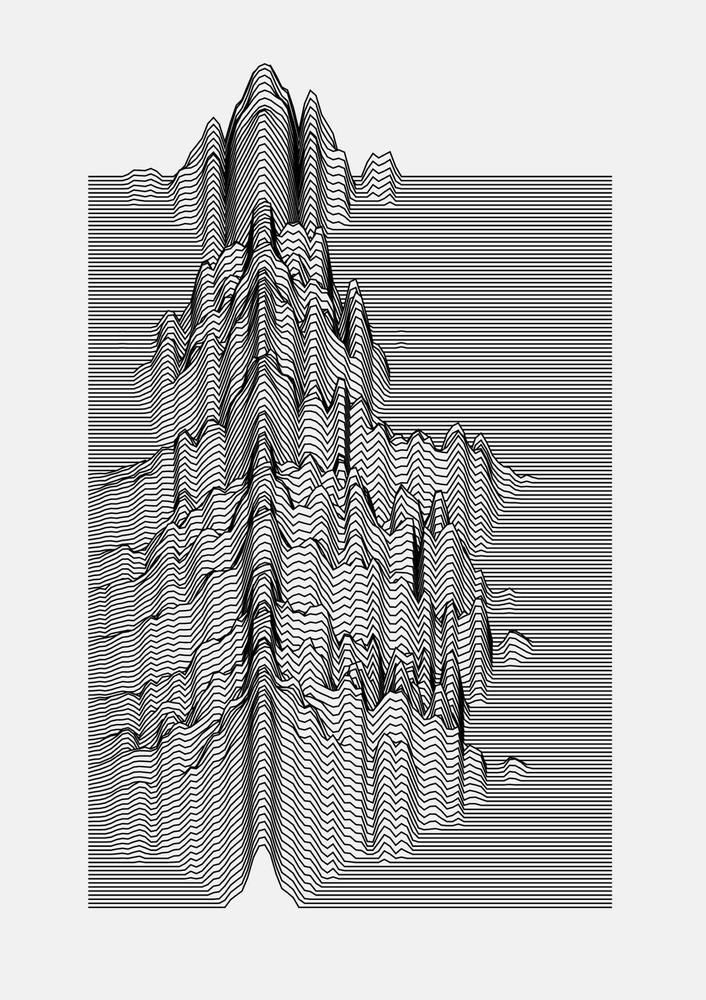
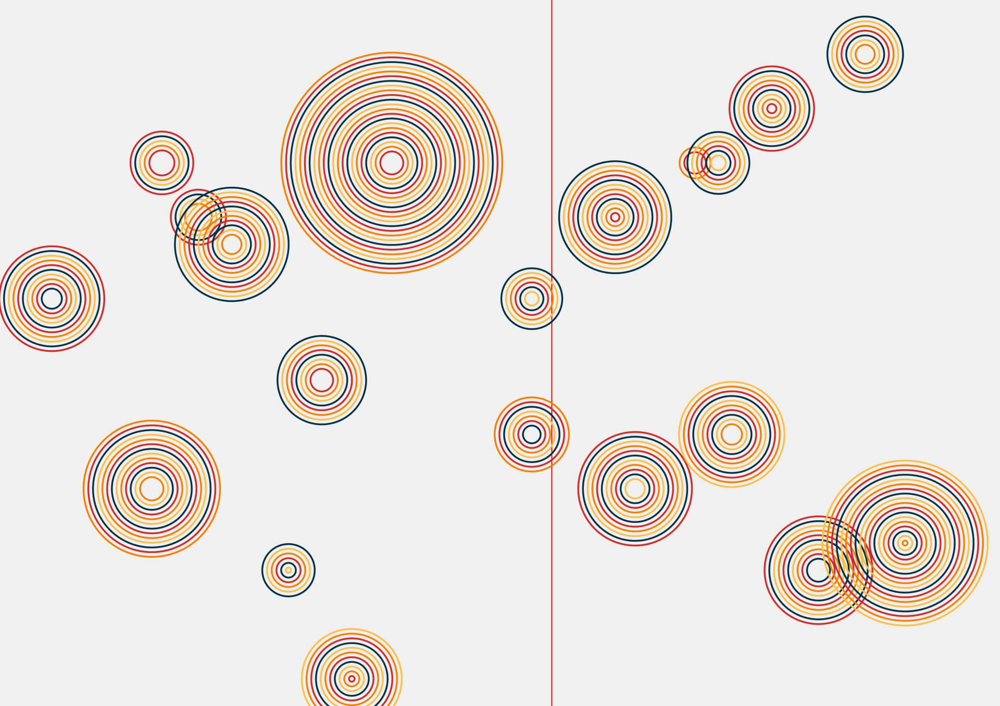
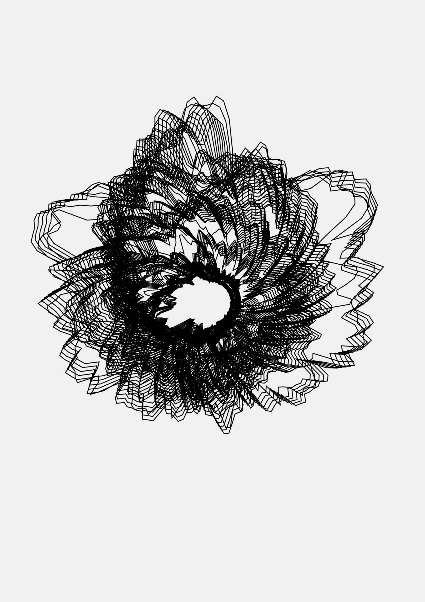
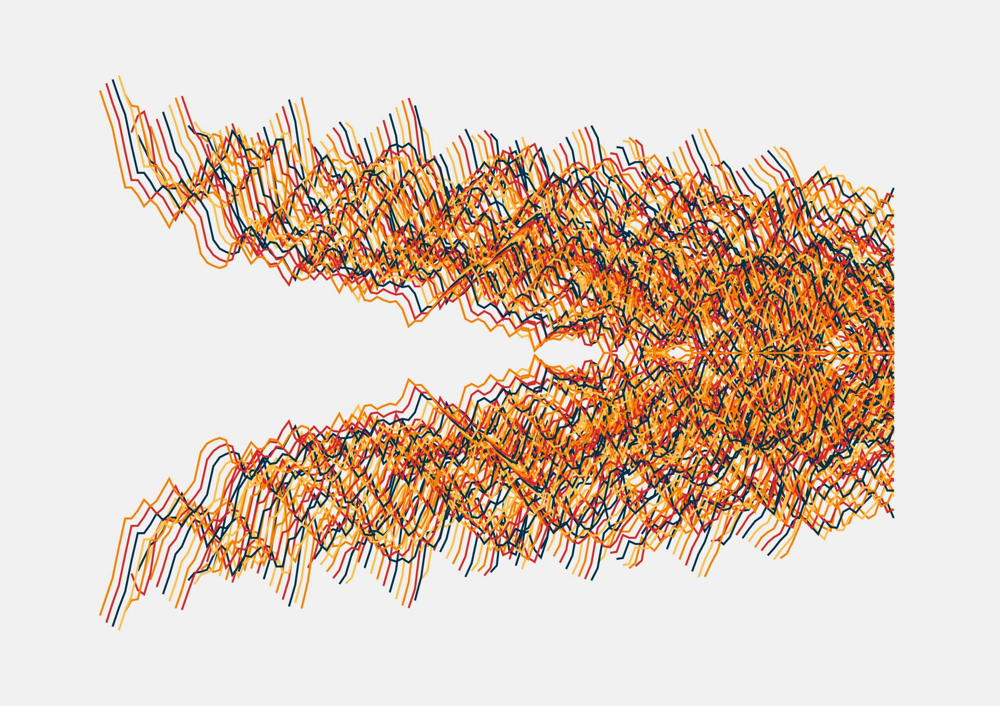

# Audio and Midi pen plotting thingies

Here's a collection of four example plotting tools I used for a mini one-day workshop. They are very messy and were only written for me (and people under supervision) to use. but I figured people may find them useful.

You _will_ need to modify the code a little to work, I'll explain below.

## MIDI vs Audio

One project `midi-circles` reacts to MIDI, the other three react to audio.

In `midi-circles` look at the lines 273-291 for setting up the midi part. Because of the way I have things set up I'm looking for specific midi input `Komplete Kontrol Virtual Output` and `Kontakt 5 Virtual Output`. If you uncomment line 278 `console.log(midiMessage.currentTarget.name)` it'll dump whatever the name of the midi input is used to the console.

If you only have one midi device you can probably take the check at line 279 out, I happen to be doing weird routing of the midi signals which is why I need to do it.

`joydivisualisation`, `reactive-circle1` and `soundwaves` all react to audio input; _again_ I'm doing weird routing. If you search for the string `3ec49099b193dcdd9c4f643800740d0ced5f85a1fcc8edc5587731378c7cb724` in each file you'll see where I'm capturing the audio. If you uncomment this `// console.log(device.kind + ': ' + device.label + ' id = ' + device.deviceId)` a few lines up it'll dump all the audio inputs to the console. You'll need to find your audio input id, and update the string to match the id.

You'll need to click on the canvas object to start audio sampling, and the browser will probably ask you for access to the microphone.

## Hidden Line Removal

Two of the projects; `midi-circles` and `joydivisualisation` need to have hidden line removal in Inkscape run on them to plot correctly. `midi-circles` because the circles will flow over the boundary of the page, `joydivisualisation` because it's using shapes in the foreground the hide lines further back. For more details on the InkScape hidden line removal and saving as `plob` files see this video: https://www.youtube.com/watch?v=uNJcdEW1vpY

## Single vs Multi-colured

`midi-circles` and `soundwaves` has multiple colours, in that it'll export a seperate file for each colour, you may need to approve multiple file downloads in the browser. You'll need to process each file of `midi-circles` for hidden line removal in turn.

You can set the value of `const maxColours = 4` to be 1-5, the colours displayed will be picked randomly from `sourceColours` array. If you want more maxColours you'll need to update the number of colours in those array (or just reduce it to one palette with a bazillion colours in). The colours it actually gets plotted in depends on your pens _obvs_

## Keyboard controls.

Pressing the keys `3`, `4`, `5` or `6` will save the SVG out at A3, A4, A5 and A6 size respectively. `midi-circles` has an additional keyboard command `c` that clears the screen and starts again.

----------

## Joydivisualisation

## midi-circles

## reactive-circles1

## soundwaves

